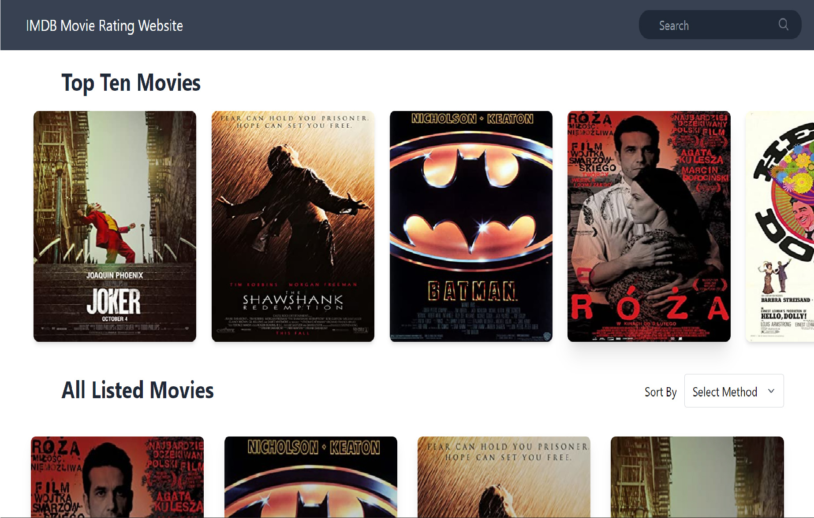
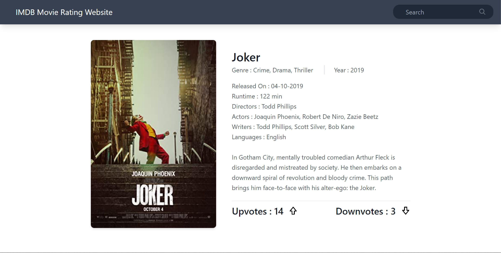
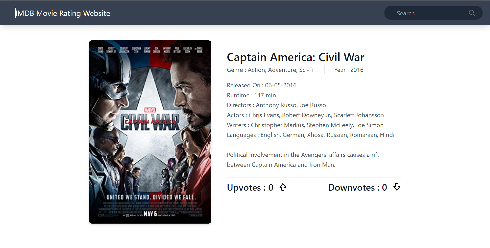
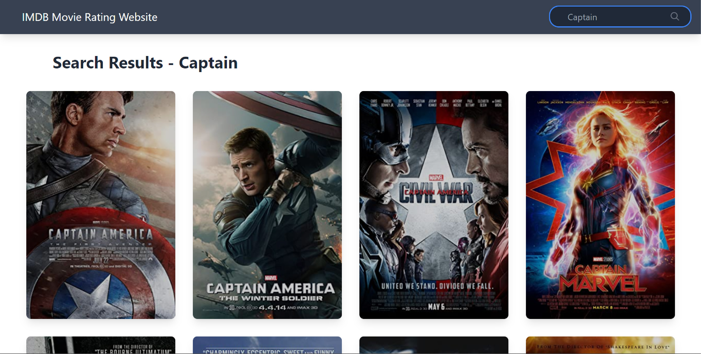
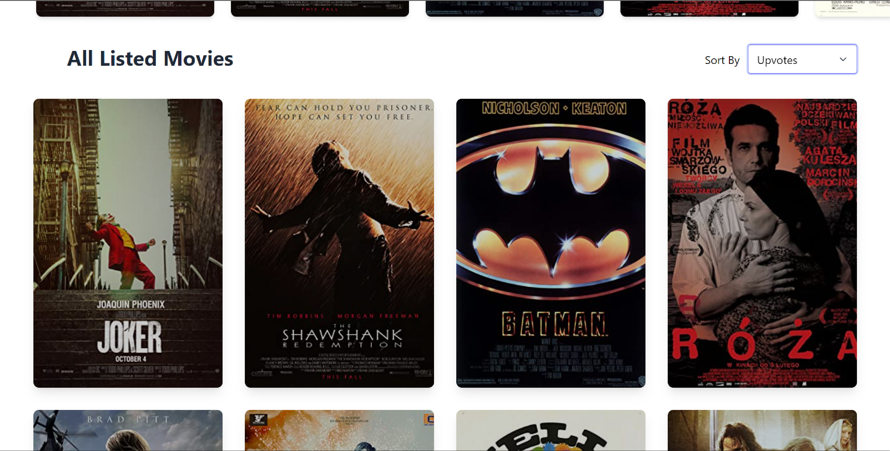
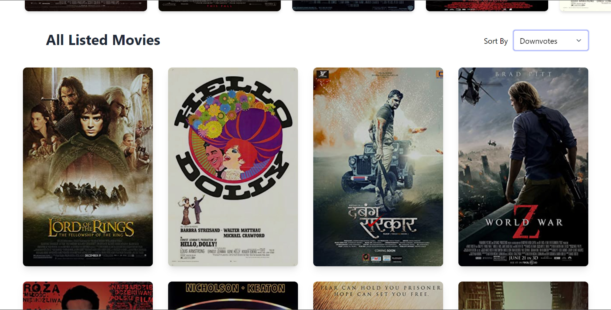
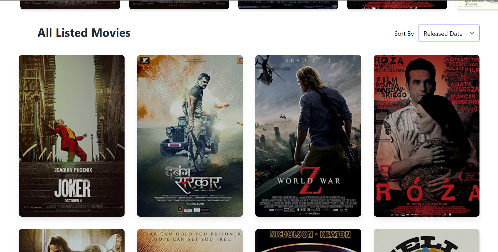
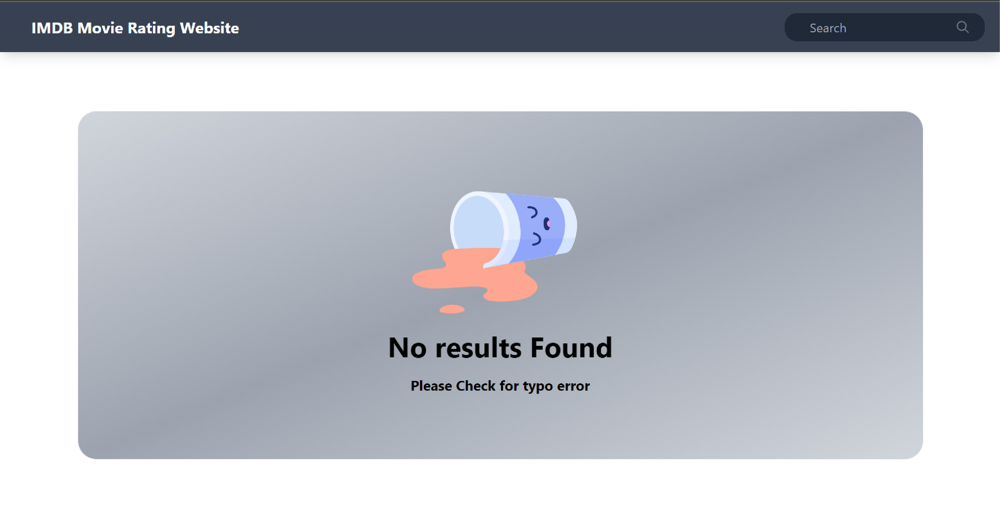

<h1>IMDB Movie Rating Website</h1>

 
 
These App is now deployed on Heroku so Go check it out

Live App Link --> https://imdb-itsyashsahu.vercel.app/

 
 

<h1>Technical Details -- </h1>

--> Pre-Rendering the pages to Improve the SEO of Website using Next.js

--> CURD operations using RESTfull Api created with help of Next.js

--> Beautiful and Fully Responsive User Interface Using Tailwind CSS.

--> Getting movies data from api OMDb.com

--> Data Stored in MonogoDB Atlas.

 
 
<h1>ScreenShots</h1>

<h3>Landing Page</h3>

 
 
 
<h3>Movie Page</h3>

 

 
 
 
<h3>Search Page</h3>

 
 
 
<h3>Sorting With Different Options</h3>

<h4>Based on Upvotes</h4>

<h4>Based on Downvotes</h4>

<h4>Based on Released Date</h4>

<h3>Error Handling</h3>

